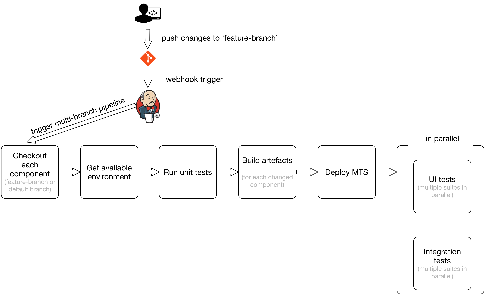

# CI / CD

The MTS Continuous Integration is branch based. Every feature must pass all the tests in the correlating feature branch before it is merged to the master branch. A release candidate is a set of artefacts produced from the master branch across all the Git repositories.

Both application and infrastructure code is part of the CI process. MTS utilizes a concept of FBEs (Feature build environment): a set of environments with production like segregation but at smaller scale.

[Jenkins](https://jenkins.io/) is the CI / CD tool used to build the MTS delivery pipelines. It utilizes the pipeline extension to build the delivery pipelines using groovy. CI for the majority of the MOT stack works in the following way:

This pipeline approach allows builds to fail fast in case of problems, and the feedback loop duration is relatively short. It is worth pointing out that components are rebuilt only when a change was applied to it. If a component is not changed during development of a feature a default artefact (build from master branch) will be used.
