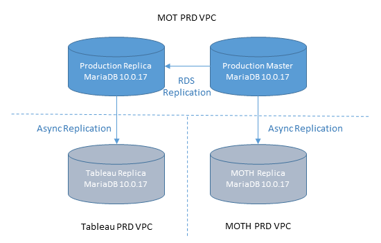

# Components

The major components of the MTS deployment environment are shown in the diagram below.  The text includes links to further detailed descriptions of each of the components.  The shaded area are the components that make up the blue/green stack, each of these stacks can be deployed and tested in isolation to reduce the amount of downtime required for a release.  

The majority of the MTS is made up of 2 large PHP applications, [PHP-FE](#php-fe) and [PHP-API](#php-api).  These handle the web front end tier and the MTS business logic respectively.

Some of the PHP functionality has been extracted into Java services, for [TEST](#test-service)s, [VEHICLE](#vehicle-service)s and [AUTHORISATION](#authorisation-service).

[Elasticache](elasticache.md) is used to cache user sessions.

User persistence, authentication and session management is handled by [OpenAM and OpenDJ](#openam-opendj).

Test certificate generation is handled by a Jasper server cluster.

Other internal clients (such as DVLA) communicate with the MTS through the [Open Interface](#open-interface).

External clients can query data using either the [Trade API](#trade-api), or the [MOT History](#mot-history) web application.

The MTS data is persisted in an AWS MariaDB RDS [database](#database) instance.

Their is a schedule [Jobs Server](jobsserver.md) that handles task such as nightly data updates.

[Consul](consul.md) is used to store configuration values within MTS.

## PHP Front end

This is the main front end to the MTS system.  It is a PHP application running in the Apache web server using Zend2 as it's MVC framework.  Although the source code is in the same repository as the PHP Back end it is split out during the build process and deployed separately.

The PHP code is the oldest in the codebase and is progressively being re-engineered into other technologies.

In production there are 12 instances of this service running which has been tested to handle up to 30,000 concurrent connections.

## PHP API

The PHP API is the main back end API of the MTS system.  Like the PHP Front end it uses Zend2 to expose the RESTful endpoints and is hosted within an Apache instance.  It communicates with the database using the Doctrine ORM.

There are 36 instances of this in production. We have tested the maximum throughput of this deployment, and it exceeds current and projected maximum demand.

## Test Service

Test service is a private MTS service used for fetching information about MOT tests conducted in MTS.

Test service uses authorisation service for permission checking and vehicle service as its data source for vehicles under test.

It is implemented using DropWizard and runs as an EC2 instance. In production there are 5 instances of this service running.

## Vehicle Service

Vehicle service is a private MTS service used for fetching and manipulating vehicles used for conducting MOT tests in MTS.

Vehicle service uses authorisation service for permission checking.

It is implemented using DropWizard and runs as an EC2 instance. In production there are 3 instances of this service running.

## Authorisation Service

Authorisation service is a private MTS service used for permissions management (check and assignment) as well as manipulation of 2FA (two-factor authentication) cards.

It is implemented using DropWizard and runs as an EC2 instance. In production there are 3 instances of this service running.

## Open Interface

Open interface service allows fetching information about MOT test passed for a certain vehicle (identified by VRM - Vehicle Registration Mark) with providing an optional upper bound date (returning only tests that were conducted before the provided date).

The service uses MOT PHP Api as its data source (with underlying MOT RDS database). It is implemented using Spring Boot and runs as an EC2 instance. In production there are 3 instances of this service running.

## Database

The MOT application employs MySQL MariaDB (10.0.17) databases for its primary persistent data store.

It uses Amazon Relational Database Service (RDS) to host the primary production database and a secondary read replica database for fail-over/disaster recovery.
The primary database and its read replica are an Amazon RDS replica pair configured using RDS out-of-the-box replication.

In addition to the two main databases, there are two other read replicas, one of which serves MOT History (MOTH) application, and the other serves MI Reporting using Tableau.  These additional replicas use manually configured asynchronous MySQL replication. This is because the MOTH and MI Reporting applications are hosted in separate Virtual Private Clouds (VPC) and it is not possible to use the RDS managed replication across VPCs.

The MOTH database replicates directly from the MOT master database.
The MI Reporting database replicates from the MOT read-replica database.

This is depicted in the diagram below:

All of these database instances have a storage footprint of 1500GB (roughly 1.5TB). MOTH, though it occupies the same footprint, does not hold all the data that the other instances hold as it uses the MariaDB (and MySQL) 'Blackhole' storage engine for most of the MOT replica tables in order that they store no data at all.

The purpose of this storage engine, in this context, is to allow the MOT database to be fully replicated to the MOTH database but the data stored gets filtered down to just the data the MOTH application requires to function properly.  For example, the MOTH application has no need of MOT's user data, so any data that replicates to the 'user' table is not written to storage, and consequently is not available to the MOTH application.

## MOT History

Mot History enables users of the public to query vehicle mot history using vehicle's make and registration number.

### MOT History Frontend
Mot History Frontend enables citizens to query MOT database for vehicle MOT history. It is implemented using Zend framework and runs as an EC2 instance.

### MOT History API
MOT History API queries MOT read replica instance to fetch MOT history of a given vehicle. It is implemented using DropWizard and runs as an EC2 instance.

## MOT Reminders (MOTR)

MOTR infrastructure is fully serverless which means that there is no need to manage any underlying infrastructure like EC2 instances and there is no VPC related (networking) configuration.

All  services used to build the MOTR are located in the AWS public cloud but access to them is either limited on the AWS account level or with use of appropriate IAM roles/policies.

MOTR infrastructure consist of two parts:

1. FRONTEND (Online) - allows visitors to subscribe and unsubscribe for reminders, including confirmation links.
1. BACKEND (Offline) - does the subscription processing work, daily determines which subscriptions should get a reminder and delivers reminders via GOV.UK Notify.

MOTR is integrated with two 3rd party services:

1. GOV.UK Notify to notify subscribers using email and potentially text messages in the future.
1. MOTH Trade API to retrieve information about vehicle tests and their expiry dates.

## MOT Intelligence

Mot Intelligence enables users of the public to submit anonymous intelligence about MOT tests.

### MOT Intelligence Frontend
Mot Intelligence Frontend enables citizens to submit intelligence via web forms. It saves each submission in an S3 bucket. It is implemented using DropWizard and runs as an EC2 instance.

### MOT Intelligence Processor
MOT Intelligence Processor collects submissions from S3 and aggregates them to a single XML document. Processor creates a manifest, and tars and zips the two files. It finally adds them to the S3 bucket storing daily reports.

It is triggered daily by CloudWatch Events.  It is implemented using DropWizard and runs as an EC2 instance.
